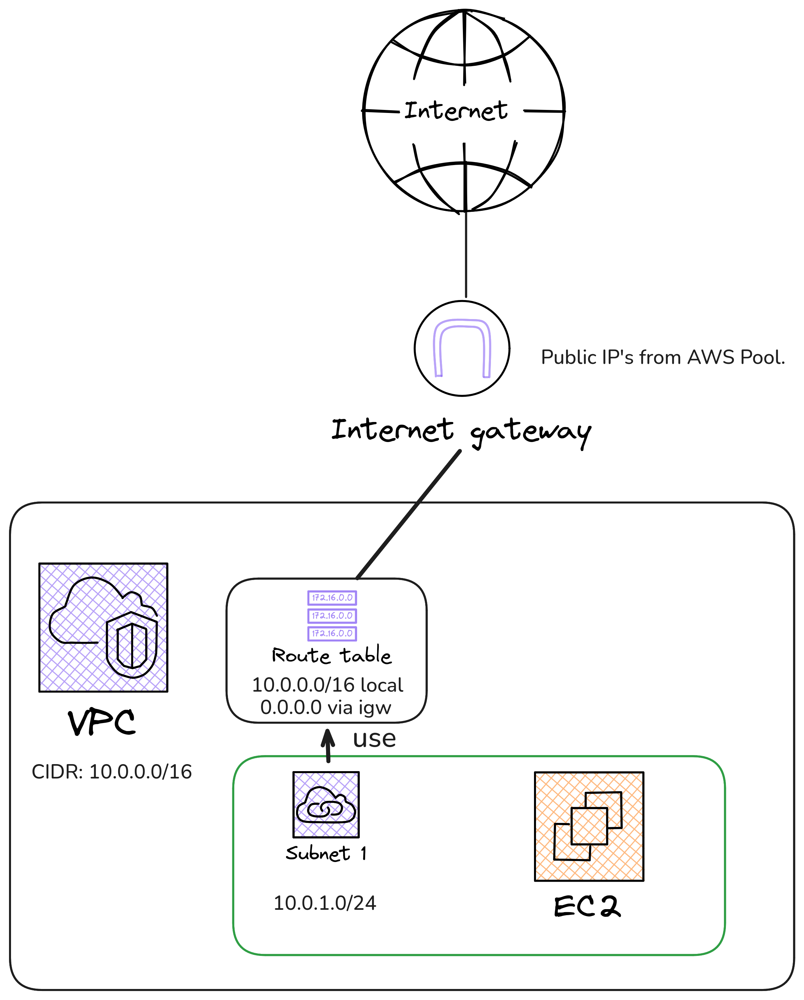
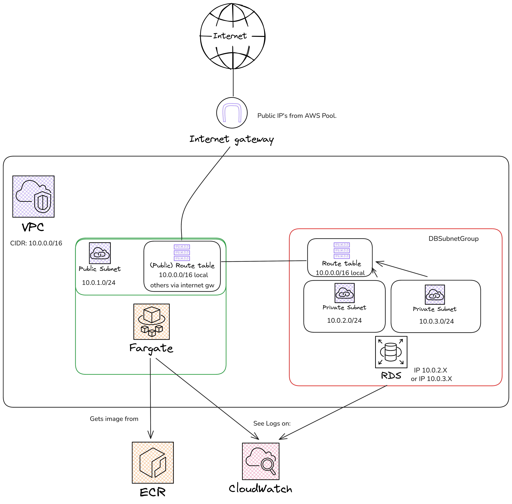

# Goals for today

- Understand why we probably need someone to manage our Database.
- See how RDS works and what can it offers us.

# Recap

- What we covered in the last class.

## Running our API (server + database) with docker on EC2

{fig-align="center"}

## What could be wrong (on the database side)?

- Scalabilty issues.
- Non-Redundancy issues.
- The EC2 disk is full.

# Welcome RDS!

A service that amazon gives to us, so we can:

- Scale.
- Add Redundancy.
- No need to worry about installing PostgreSQL or other dependencies.

## Configure RDS:

- The RDS must live on a VPC.
- The RDS must live on a SubnetGroup [^1] and each subnet should live on a different AZ (Availability-Zone).
- You must configure the instance that runs it (it uses EC2 under the hood).

[^1]: [A subnet group is a collection of subnets (typically private) that you can designate for your node-based clusters running in an Amazon Virtual Private Cloud (VPC) environment.](https://docs.aws.amazon.com/AmazonElastiCache/latest/dg/SubnetGroups.html)

## Architecture 

{fig-align="center"}

## Why a SubnetGroup? Why two Availability Zones?

- Because RDS has Multi-Available Zones.
- You'll study how this works under the hood on [Ampliació de Bases de Dades i d'Enginyeria del Programari \[102019\]](https://guiadocent.udl.cat/html/2025-26_102019)
- If you don't want Multi-Available Zones, you can disable it, but you still have to create a SubnetGroup [^2] ...

[^2]: [See the issue that explains it](https://github.com/aws/aws-cdk/issues/30520#issuecomment-2161016035)

## Summary

- ECR is just an EC2 with a pre-configured database.
- It gives us the possibility to have two Availability Zones, for redundancy (Multi-AZ).
- Backup options, etc.
- It's NOT cheap.

# References

## Really Recommended References: {.smaller}

- [RDS Multi-AZ zone](https://github.com/aws/aws-cdk/issues/30520#issuecomment-2161016035)
- [HackerNews thread RDS vs Aurora](https://news.ycombinator.com/item?id=32047997)
- [HackerNews thread roasting RDS](https://news.ycombinator.com/item?id=39322275)

## Additional Exercices {#extra .smaller}

If you really want to understand a little bit more what happens under the hood, you can do the following exercices. Be aware that you should read the "Really Recommended References" first, and then try to do this exercices.

- [Use the AWS Lambda service for doing something cool, or, if you don't have any ideas, do this PraLab from the AMSA Igualada Course!](https://amsa-gei-udl-2526-105013.github.io/course/laboratories/05-lambda/01-lambda.html)

